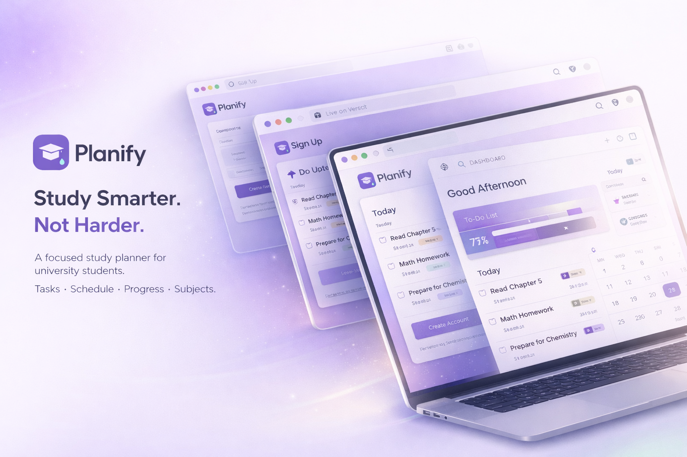
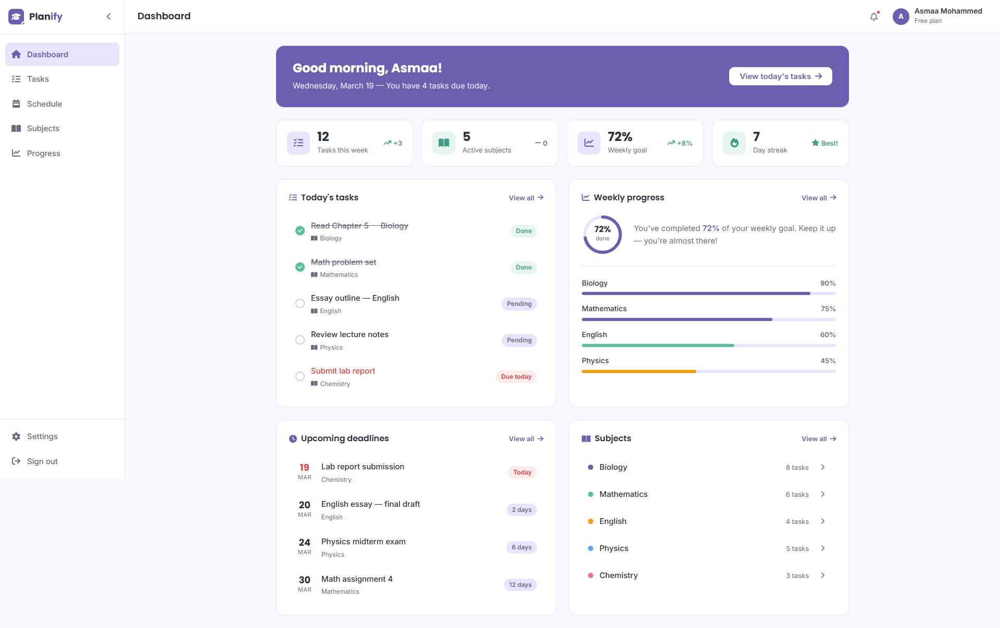
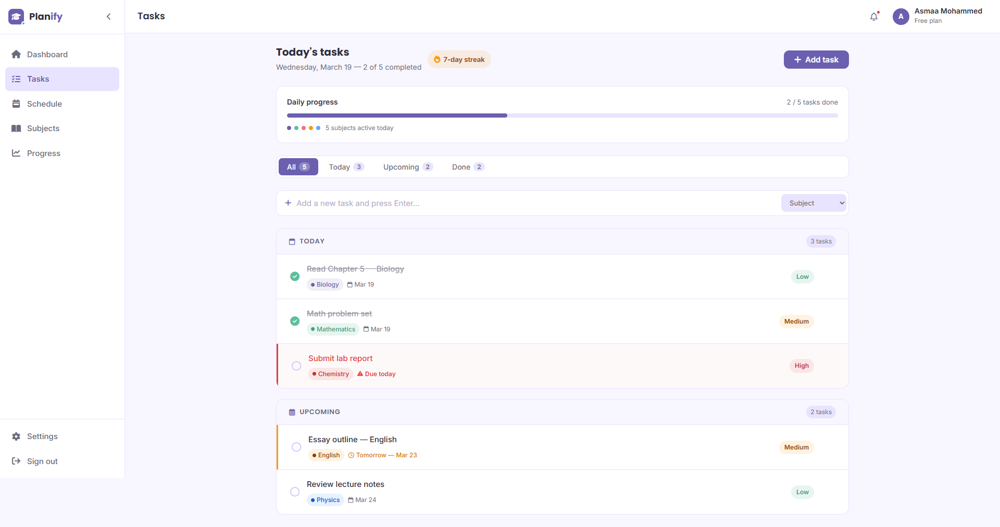
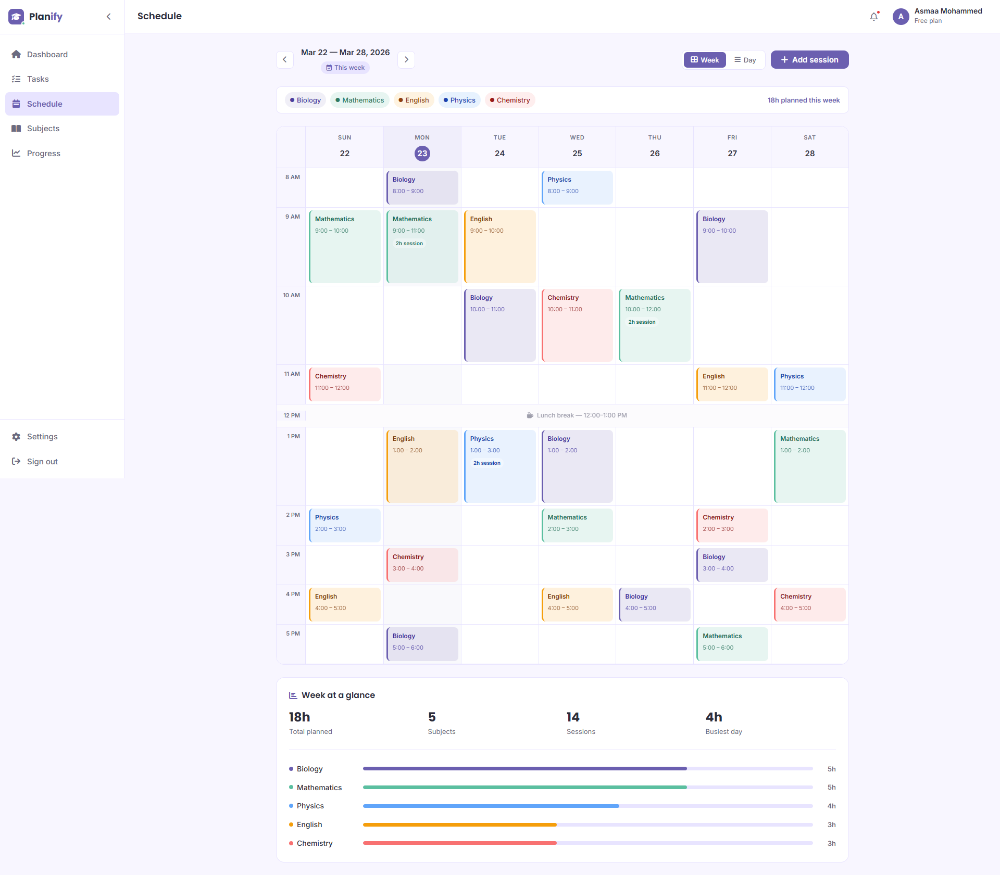

# Planify
# Study Smarter. Not Harder.

A study planner for university students. Built to help you stay on top of your subjects, tasks, and weekly schedule without the chaos.

**Live -** [planify-study-planner.vercel.app](https://planify-study-planner.vercel.app)



---

## Why I built this

I kept seeing the same problem - students (including me) juggling multiple subjects with no real system. Tasks pile up, deadlines sneak up, and by the end of the week you're not sure what you actually got done.

So I built Planify. A simple, focused space to plan your study week and actually see your progress.

---

## Pages

| Page | What it does |
|------|-------------|
| Landing | Overview of the app, features, and pricing |
| Sign up / Sign in | Auth pages with form validation |
| Dashboard | Your week at a glance - tasks, progress, deadlines |
| Tasks | Daily task list with priorities, subject tags, and streak |
| Schedule | Weekly calendar with color-coded sessions per subject |
| Subjects | All your subjects with progress and next deadline |
| Progress | Stats, activity chart, streak, and achievements |
| Settings | Profile, password, preferences, and notifications |

---

## Screenshots

### Dashboard


### Tasks


### Schedule


---

## Built with

- HTML5
- CSS3
- Vanilla JavaScript
- Font Awesome
- Google Fonts 
- Deployed on Vercel

---

## Project structure

```
planify/
├── index.html
├── signin.html
├── signup.html
├── dashboard.html
├── tasks.html
├── schedule.html
├── subjects.html
├── progress.html
├── settings.html
└── assets/
    ├── styles/
    │   ├── style.css
    │   ├── app.css
    │   ├── landing.css
    │   ├── auth.css
    │   ├── dashboard.css
    │   ├── tasks.css
    │   ├── schedule.css
    │   ├── subjects.css
    │   ├── progress.css
    │   └── settings.css
    └── js/
        ├── app.js
        ├── main.js
        └── animations.js
```

---


## What I picked up along the way

Honestly this project pushed me more than I expected. A few things that stuck with me:

- Responsive design is harder than it looks - especially when you care about how it feels on mobile, not just that it fits
- Keeping CSS organized across 10 pages takes real discipline
- Accessibility isn't extra work, it's just part of building things properly
- The gap between "it works" and "it feels right" is where most of the real work happens

---

## Author

**Asmaa Mohammed**
Frontend Developer

[GitHub](https://github.com/asmaammohammed) · [LinkedIn](https://www.linkedin.com/in/asmaa-mohammed21/) · [Live Demo](https://planify-study-planner.vercel.app/)

---

